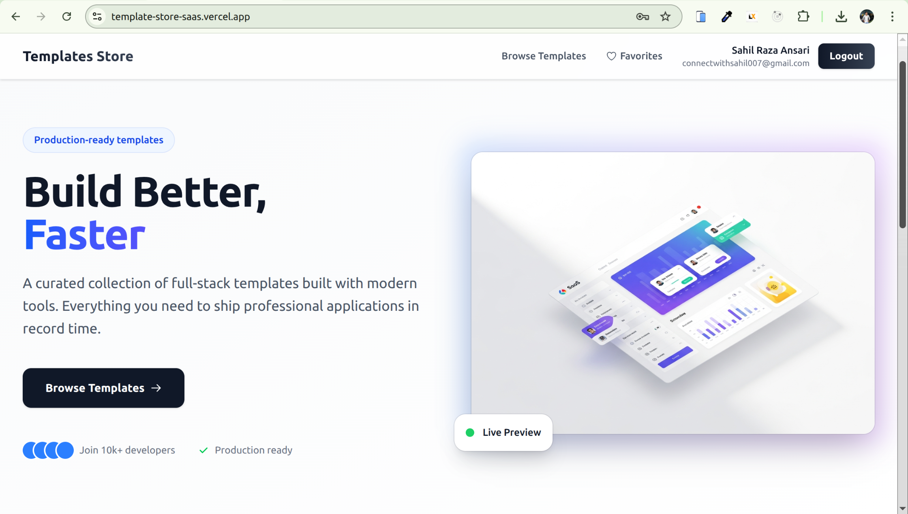

# Template Store

A production-ready full-stack web application for browsing and managing project templates.
<p align="center">
  <a href="https://template-store-saas.vercel.app/">
    
  </a>
</p>

## Overview

Template Store is a centralized platform designed for discovering, searching, and managing reusable project templates. It showcases a curated collection of real-world templates for full-stack applications, mobile apps, and specialized projects.

## Key Highlights

- JWT-based authentication using httpOnly cookies
- Responsive UI with React and Tailwind CSS
- Production-ready setup with rate limiting, CORS, and security headers
- Debounced search and optimized queries
- Scalable monorepo architecture

## Tech Stack

### Frontend

| Technology      | Purpose          | Reasoning                                         |
| --------------- | ---------------- | ------------------------------------------------- |
| React 19        | UI Framework     | Modern, performant, widely supported              |
| Vite            | Build Tool       | Fast HMR and optimized builds                     |
| React Router v7 | Routing          | Improved nested routing support                   |
| Tailwind CSS    | Styling          | Faster UI development with utility-first approach |
| Axios           | HTTP Client      | Better error handling and interceptors            |
| Context API     | State Management | Lightweight alternative to Redux                  |
| React Toastify  | Notifications    | Simple async UI feedback                          |

### Backend

| Technology         | Purpose          | Reasoning                                 |
| ------------------ | ---------------- | ----------------------------------------- |
| Node.js + Express  | Server Framework | Mature ecosystem and middleware support   |
| Sequelize v6       | ORM              | Migrations and SQL protection             |
| JWT                | Authentication   | Stateless and scalable session management |
| bcryptjs           | Password Hashing | Secure salted hashing                     |
| Helmet             | Security Headers | Protection from common attacks            |
| express-rate-limit | DDoS Protection  | Prevents brute-force attacks              |

### Database

PostgreSQL 13+

- ACID compliant
- Powerful advanced queries
- Scalable with indexing
- JSONB support for flexible data
- Strong cloud ecosystem support

## Features

### Authentication & Security

- Secure registration and login
- JWT stored in httpOnly cookies
- Protected API routes
- Bcrypt password hashing
- Rate-limited sensitive endpoints

### Core Functionality

- Search templates with debouncing
- Category filtering
- Favorite templates
- Rich template descriptions
- Responsive design

### Developer Experience

- Docker integration for database
- Database migrations and seeding
- Hot Module Replacement
- Clear monorepo structure

## Project Structure

```
template-store/
├── client
│   ├── public
│   │   ├── favicon.png
│   │   └── Thumbnail.png
│   ├── src
│   │   ├── assets
│   │   ├── components
│   │   ├── context
│   │   ├── hooks
│   │   ├── layouts
│   │   ├── pages
│   │   └── services
│   └── vite.config.js
├── server
│   ├── migrations
│   ├── seeders
│   ├── src
│   │   ├── controllers
│   │   ├── middlewares
│   │   ├── routes
│   │   ├── services
│   │   └── utils
│   └── server.js
└── docker-compose.yml
```

## Architecture Rationale

- Clear separation of concerns between frontend and backend
- MVC-driven Express backend
- Scalable approach for adding new features

## Live URLs

**Live Site:** [https://template-store-saas.vercel.app/](https://template-store-saas.vercel.app/)
**Backend Health Check:** [https://template-store-lcg5.onrender.com/api/health/](https://template-store-lcg5.onrender.com/api/health/)

## Prerequisites

Ensure the following are installed on your system:

- Node.js (v18 or later recommended)
- Docker & Docker Compose
- Git

## Getting Started

### Prerequisites

- Node.js v18+
- Docker Desktop
- Git

### Installation

Clone repository:

```
git clone https://github.com/your-username/template-store.git
cd template-store
```

Set up environment variables:

Root .env:

```
DB_USER=postgres
DB_PASSWORD=mysecretpassword
DB_NAME=template_store_db
```

Server `.env`:

```
NODE_ENV=development
PORT=8000
DB_USER=postgres
DB_PASSWORD=mysecretpassword
DB_NAME=template_store_db
DB_HOST=localhost
DB_PORT=5432
JWT_SECRET=your_random_secret_key
CORS_ORIGIN=http://localhost:5173
```

Client `.env`:

```
VITE_API_URL=http://localhost:8000/api
```

Start database:

```
docker-compose up -d
```

Setup backend:

```
cd server
npm install
npx sequelize-cli db:migrate
npx sequelize-cli db:seed:all
npm run dev
```

Setup frontend:

```
cd client
npm install
npm run dev
```

## Database Schema

### Users

| Column    | Type      | Constraints      |
| --------- | --------- | ---------------- |
| id        | UUID      | Primary Key      |
| name      | VARCHAR   | Required         |
| email     | VARCHAR   | Unique, Required |
| password  | VARCHAR   | Hashed           |
| createdAt | Timestamp | Auto             |
| updatedAt | Timestamp | Auto             |

### Templates

| Column             | Type      | Constraints |
| ------------------ | --------- | ----------- |
| id                 | UUID      | Primary Key |
| name               | VARCHAR   | Required    |
| short\_description | VARCHAR   | Required    |
| long\_description  | TEXT      | Optional    |
| thumbnail\_url     | VARCHAR   | Optional    |
| category           | VARCHAR   | Required    |
| createdAt          | Timestamp | Auto        |
| updatedAt          | Timestamp | Auto        |

### Favorites

| Column     | Type      | Constraints  |
| ---------- | --------- | ------------ |
| id         | UUID      | Primary Key  |
| userId     | UUID      | FK Users     |
| templateId | UUID      | FK Templates |
| createdAt  | Timestamp | Auto         |

Relationships:

- One user many favorites
- One template many favorites
- Favorites is join table

## API Documentation

Base URL: `http://localhost:8000/api`

### Authentication

POST `/auth/register`
POST `/auth/login`
POST `/auth/logout`
GET `/auth/me`

### Templates

GET `/templates`
GET `/templates?search=`
GET `/templates?category=`
GET `/templates/:id`

### Favorites

GET `/favorites`
POST `/favorites/:templateId`
DELETE `/favorites/:templateId`

## Security Features

- JWT expiration and protection
- Secure httpOnly cookies
- Validations for emails and UUID formats
- Sequelize prevents SQL injection
- Helmet and rate limiting active

## Deployment Checklist

- Update secrets and set production environment
- Restrict CORS to production domain
- Enable HTTPS and secure cookies

## Author

Sahil Raza Ansari

- GitHub: [https://github.com/SahillRazaa](https://github.com/SahillRazaa)
- LinkedIn: [https://www.linkedin.com/in/sahilraza-software-developer/](https://www.linkedin.com/in/sahilraza-software-developer/)
- Portfolio: [https://sahilraza.vercel.app/](https://sahilraza.vercel.app/)
